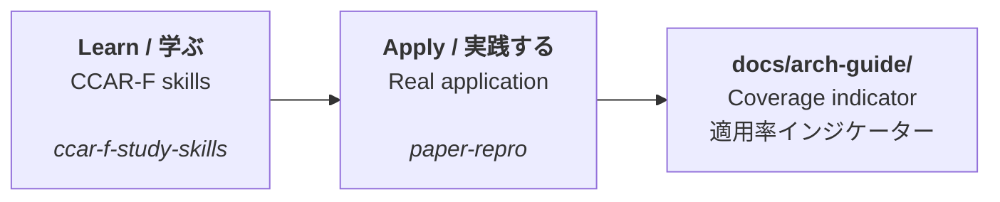

# Hi, I'm ChestnutForest 👋

Building tools that help people **read, reproduce, and learn from AI research** —
mostly with Claude, FastAPI, and Next.js.

AI論文を**読み解き、再現し、そこから学ぶ**ための道具を作っています。
主に Claude・FastAPI・Next.js を使っています。

---

## 🔭 What I'm working on / いま取り組んでいること

**Applying certification-level architecture patterns to a real product.**
I'm studying the Claude Certified Architect – Foundations (CCAR-F) curriculum,
and applying what I learn directly to an application I'm building —
then measuring how much of it I've actually applied.

**認定試験レベルの設計の型を、実際のプロダクトに適用する**ことに取り組んでいます。
Claude Certified Architect – Foundations（CCAR-F）で学んだ内容を、
開発中のアプリにそのまま適用し、**どこまで適用できたかを計測して記録**しています。

---

## 📦 Projects / プロジェクト

| Repository | What it is | 概要 |
|---|---|---|
| [**paper-repro**](https://github.com/ChestnutForest/paper-repro) | A human-in-the-loop tool for reading and reproducing arXiv papers. FastAPI + Next.js. | arXiv論文の読解〜再現実装を支援するツール（人間の承認を挟む設計） |
| [**ccar-f-study-skills**](https://github.com/ChestnutForest/ccar-f-study-skills) | Custom Claude Skills for CCAR-F exam preparation. | CCAR-F試験対策のCustom Claude Skills集 |
| [**processloop**](https://github.com/ChestnutForest/processloop) | Process Dashboard (GPLv3) fork — Next.js port with en/ja i18n. | Process Dashboard のフォーク。Next.js移植＋日英対応 |
| [**software-engineering-bok**](https://github.com/ChestnutForest/software-engineering-bok) | A reference index of software engineering methods, recorded with their primary sources and licence terms. | ソフトウェア工学の手法を、一次資料と使用条件つきで記録する参照集 |
| [**Deepware**](https://github.com/ChestnutForest/Deepware) | A scratch repository, created for testing. | 動作確認のために作ったテスト用リポジトリ |
| [**antigravity-sandbox**](https://github.com/ChestnutForest/antigravity-sandbox) | <!-- TODO: add a one-line description --> | <!-- TODO: 一行の説明を追記 --> |

---

## 🎯 Interests / 関心領域

- **Paper reproduction workflows** — turning a paper into runnable, verified code
  （論文を、動いて検証できるコードに落とすまでの流れ）
- **Human-in-the-loop agent design** — approval gates over full automation
  （全自動より、承認ゲートを挟む設計）
- **Structured output & reliability** — JSON schemas, validation loops, provenance
  （構造化出力と信頼性 — スキーマ、検証ループ、出典の保持）
- **Knowledge capture** — turning daily development into searchable, reusable logs
  （日々の開発を、検索・再利用できる記録に変えること）
- **Software process** — PSP/TSP, measurement, and continuous improvement
  （ソフトウェアプロセス — 計測と継続的改善）
  → [processloop](https://github.com/ChestnutForest/processloop) · [software-engineering-bok](https://github.com/ChestnutForest/software-engineering-bok)

---

## 🛠️ Tech I use / 使っている技術

**Backend**  Python · FastAPI · SQLAlchemy · PostgreSQL · Celery / Redis
**Frontend** TypeScript · Next.js · React
**Tooling**  Claude Code · Docker · Git · pytest · Ruff

---

## 📊 A note on how I work / 進め方について

I keep a **daily development log** for each project, and I measure my own progress —
including how much of what I've studied I've actually put into practice.
It keeps learning and building connected instead of separate.

各プロジェクトで**日次の開発ログ**を残し、進捗を自分で計測しています。
「学んだこと」と「実際に適用したこと」を切り離さないための工夫です。
